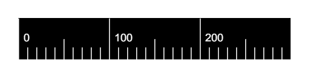

<p align="middle" ></p>
<h2 align="middle">Ruler</h2>

## ⚙️ Install

### yarn

```sh
yarn add @kedachen/ruler
```

## 🚀 How to use

```code
import Ruler from "@kedachen/ruler";

const App = () => {
  return <Ruler height={26} zoom={1} min={-120} lineColor="red" />;
};

export type LineStyle = {
  color?: string;
  width?: number;
  shortLength?: number; //短线(最小刻度)长度 默认为总高度30%
  mediumLength?: number; //中线(大刻度一半)长度 默认为总高度 50%
  longLength?: number; //长线(大刻度) 默认为总高度
};

export type TextStyle = {
  color?: string;
  size?: number;
  align?: 'left' | 'right' | 'center';
  baseLine?: 'top' | 'middle' | 'hanging'; //基线对齐 默认middle
  top?: number; //文字距离顶部位置 默认居中高度50%
  left?: number; //文字距离左边位置 默认6px
};

export type Props = {
  height?: number;
  width?: number;
  backgroundColor?: string;
  scaleLineStyle?: LineStyle;
  textStyle?: TextStyle;
  min?: number;
  max?: number;
  zoom?: number;
  horizontal?: boolean;
  onHover?: (ev: HTMLElementEventMap['mousemove']) => void;
};

```
